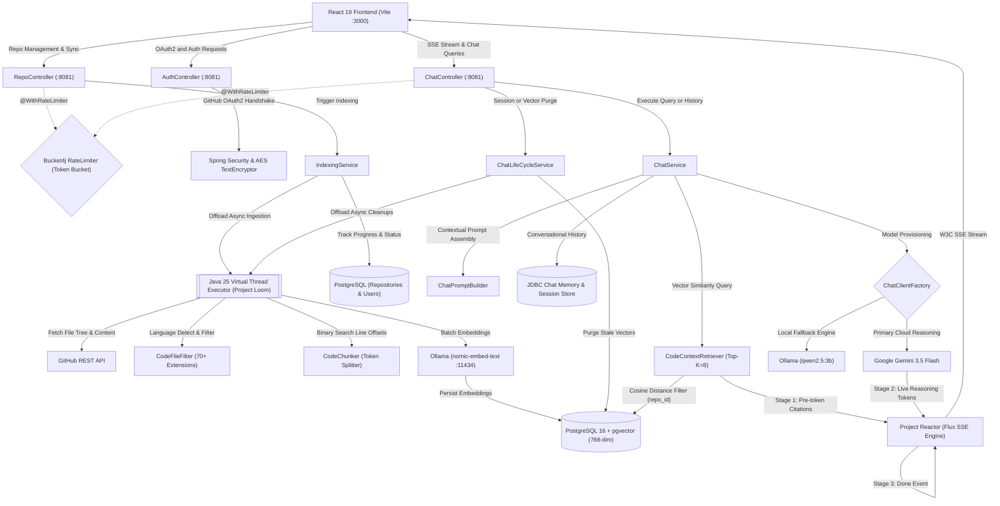
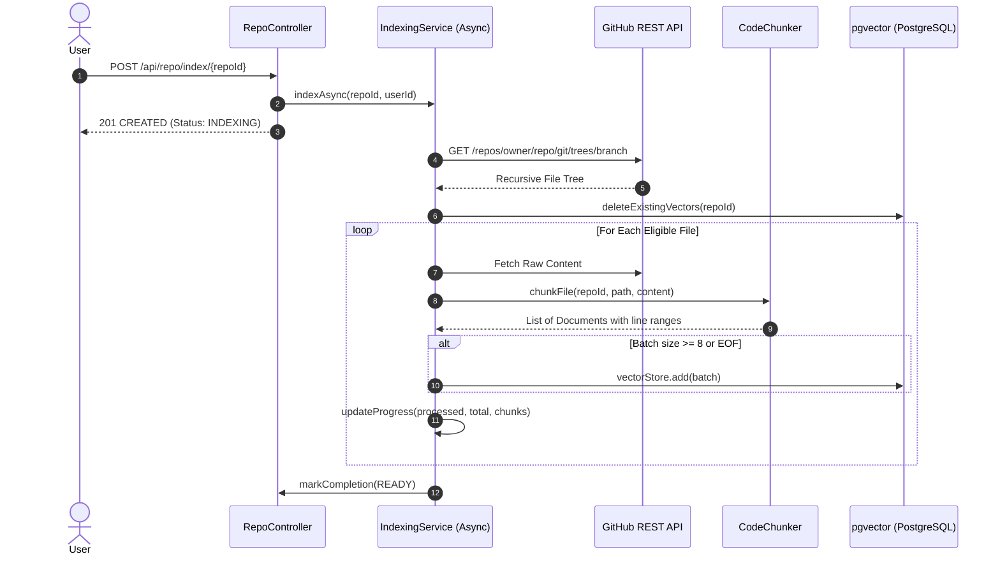
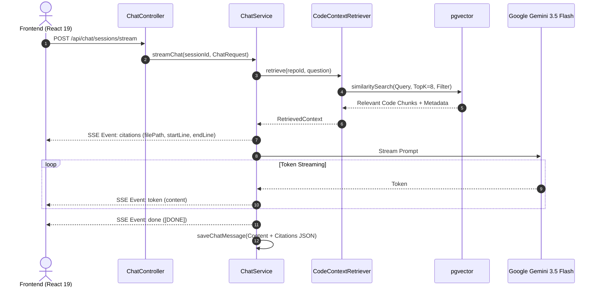

# 🧠 CodeMind

> **Enterprise-Grade AI Codebase Intelligence & High-Performance RAG Platform**  
> Built on **Java 25**, **Spring Boot 4**, **Spring AI 2.0.1**, **PostgreSQL + pgvector**, **Google Gemini 3.5 Flash**, **Ollama**, and **React 19**.

---

## 📌 Problem Statement

Software engineering teams spend **up to 60% of their engineering hours reading, tracing, and grokking existing code** rather than writing new features. Modern application codebases present distinct challenges:

1. **Context Window Limitations & Hallucination**: Traditional LLM interfaces cannot ingest an entire multi-megabyte codebase without exceeding context limits, inflating inference costs, or inducing hallucinations.
2. **Loss of Structural Context in Naive Chunkers**: Conventional character-count or paragraph-based text splitters break functions in half, lose file path associations, and destroy indentation—rendering code unintelligible to language models.
3. **Imprecise Citations**: Generic AI coding assistants give high-level answers without verifiable proof, leaving developers to manually hunt down where functions, schemas, or vulnerabilities actually live.
4. **Security & Access Boundary Risks**: Storing raw GitHub personal access tokens or OAuth credentials in plaintext creates critical attack vectors for repository exfiltration.

---

## 🚀 The CodeMind Solution & Core USPs

CodeMind solves these fundamental problems through a dedicated, backend-centric Retrieval-Augmented Generation (RAG) architecture engineered in **modern Java 25** powered by **Project Loom Virtual Threads**:



### 1. 🧵 High-Throughput Concurrency with Java 25 Virtual Threads (`AppConfig.java`)
- **Project Loom Virtual Threads**: Configured via `Executors.newVirtualThreadPerTaskExecutor()` for the `@Async("indexingExecutor")` task runner.
- **Unbounded Lightweight Concurrency**: Ingestion involves extensive I/O (fetching hundreds of files from GitHub REST API, calculating token boundaries, and batching HTTP embedding calls to Ollama). Virtual threads eliminate carrier thread blocking and thread pool starvation, allowing massive parallel indexing without the memory footprint of platform OS threads.

### 2. 🔍 Binary-Search Line-Accurate Code Chunker (`CodeChunker.java`)
Unlike naive splitters, CodeMind computes character-to-line index boundaries using binary search ($O(\log N)$) across a pre-calculated newline offset array.
- **Line-Exact Metadata**: Every chunk tracks exact `start_line`, `end_line`, `file_path`, `language`, and `chunk_index`.
- **Preserved Code Semantics**: Code chunks prepend contextual path headers (`// File: src/main/java/...`) so the LLM retains file namespace awareness during embedding generation and vector lookup.
- **70+ Language Syntax Support**: Filters and optimizes code across Java, TypeScript, Python, Rust, Go, C++, SQL, Dockerfile, Terraform, and more while safely ignoring build artifacts, lockfiles, and binaries.

### 3. ⚡ High-Dimensional Vector Search with Spring AI & `pgvector`
- **Embedding Pipeline**: Chunks are embedded into 768-dimensional vector spaces using `nomic-embed-text` via Ollama and stored in PostgreSQL using the `pgvector` extension.
- **Metadata Isolation**: Vector similarity queries execute against cosine distance (`COSINE_DISTANCE`) with explicit repository boundary filters (`repo_id`), ensuring multi-tenant isolation and zero cross-repository data contamination.
- **Batched Ingestion**: Vectorization runs asynchronously on virtual threads in controlled batches (8 chunks/batch) with live progress persistence.

### 4. 🎯 Multi-Stage Reactive Streaming via W3C Server-Sent Events (SSE)
Built on **Project Reactor** (`Flux<ServerSentEvent<String>>`), CodeMind streams responses via a 3-stage protocol:
1. **Stage 1 (`event: citations`)**: Emits JSON-serialized file paths and line ranges retrieved from the vector store before token generation begins.
2. **Stage 2 (`event: token`)**: Streams individual reasoning and code tokens in real time directly from Google Gemini 3.5 Flash.
3. **Stage 3 (`event: done`)**: Emits `[DONE]` sentinel and automatically persists the conversation to PostgreSQL.

### 5. 🔄 Autonomous Session & Vector Lifecycle (`ChatLifeCycleService.java`)
- **Ghost Session Garbage Collection**: Cleanly eliminates orphaned chat sessions where no messages were exchanged, keeping user workspaces clutter-free.
- **Atomic Repository Re-indexing**: Re-indexing automatically purges stale vector embeddings from `vector_store` and associated chat sessions before re-embedding, preventing zombie vector drift.

### 6. 🛡️ Defense-in-Depth Security & Rate Limiting
- **AES Token Encryption**: User GitHub OAuth tokens are encrypted at rest with AES (`TextEncryptor`) using dynamic salts and encryption keys before persistence.
- **HTTP-Only Session Management**: Zero JWT storage in `localStorage`. Uses hardened `CODEMIND_SESSION` HTTP-only cookies with `SameSite=Lax` and 7-day lifecycles.
- **Bucket4j Token Bucket Rate Limiting**: Interceptor-based IP rate limiter (`@WithRateLimiter`) prevents API abuse and LLM exhaustion (5-capacity burst with greedy 2-second replenishment).

---

## 🏗️ Architecture & Data Flow

### 1. Ingestion & Indexing Pipeline



### 2. Retrieval & Streaming Chat Pipeline



---

## 🛠️ Technology Stack

| Layer | Technologies |
| :--- | :--- |
| **Backend & Concurrency**| **Java 25** (Project Loom Virtual Threads via `Executors.newVirtualThreadPerTaskExecutor()`), Spring Boot 4.1.1, Spring Data JPA, Spring Security OAuth2 |
| **AI & Vector Core** | Spring AI 2.0.1, Google GenAI (`gemini-3.5-flash`), Ollama (`qwen2.5:3b`, `nomic-embed-text`), `pgvector` |
| **Reactive Streaming** | Project Reactor, Server-Sent Events (SSE), Non-blocking `Flux` |
| **Database & Cache** | PostgreSQL 16+ with `vector` extension, HikariCP, JDBC Chat Memory |
| **Security & Utilities**| Spring Security Crypto (`TextEncryptor`), Bucket4j 8.19.0 (Rate Limiting), Jackson 3 |
| **Frontend Framework** | React 19, TypeScript, Vite 8, Tailwind CSS v4, Base UI, TanStack Query v5 |
| **Code Highlighting** | PrismJS, React Markdown, Remark GFM, Lucide Icons |
| **Build & Tooling** | Maven (Backend), PNPM exclusively (Frontend) |

---

## 📡 API Specification

### Authentication (`/api/auth`)
| Method | Endpoint | Description | Auth Required |
| :--- | :--- | :--- | :--- |
| `GET` | `/api/auth/login-url` | Returns the GitHub OAuth2 authorization URL | ❌ No |
| `GET` | `/api/auth/me` | Returns current authenticated user profile & GitHub identity | ✅ Yes |
| `POST`| `/api/auth/logout` | Invalidates session and clears `CODEMIND_SESSION` cookie | ✅ Yes |

### Repository Management (`/api/repo`)
| Method | Endpoint | Description | Rate Limited |
| :--- | :--- | :--- | :--- |
| `GET` | `/api/repo?refresh=true` | Syncs user repositories with GitHub API and returns list | ❌ No |
| `GET` | `/api/repo/{id}` | Retrieves repository details and indexing metadata | ❌ No |
| `GET` | `/api/repo/{id}/status` | Polls indexing progress (`INDEXING`, `READY`, `FAILED`) | ❌ No |
| `POST`| `/api/repo/index/{repoId}`| Triggers asynchronous background indexing pipeline | ✅ Yes (`@WithRateLimiter`) |
| `DELETE`| `/api/repo/{id}` | Purges all vector embeddings, chat sessions, and resets index | ❌ No |

### AI Chat & RAG (`/api/chat`)
| Method | Endpoint | Headers / Body | Description |
| :--- | :--- | :--- | :--- |
| `POST` | `/api/chat/sessions/{repoId}/create` | Path: `repoId` | Initializes a new chat session UUID |
| `POST` | `/api/chat/sessions/stream` | Header: `session_id`<br>Body: `ChatRequest` | Streams citations and tokens via Server-Sent Events |
| `GET` | `/api/chat/sessions/history` | Header: `session_id` | Retrieves historical messages and citations for a session |
| `GET` | `/api/chat/sessions/{repoId}` | Path: `repoId` | Lists all active non-empty chat sessions for a repo |
| `DELETE`| `/api/chat` | Header: `session_id` | Deletes a chat session and associated memory records |

---

## ⚙️ Configuration Reference

Configure the following variables in `code-mind-backend/.env` or system environment:

| Variable | Required | Description | Example |
| :--- | :---: | :--- | :--- |
| `DB_USERNAME` | Yes | PostgreSQL user | `postgres` |
| `DB_PASSWORD` | Yes | PostgreSQL password | `your_secret_password` |
| `GOOGLE_API_KEY` | Yes | Google Cloud Gemini API key | `AIzaSy...` |
| `GITHUB_CLIENT_ID` | Yes | GitHub OAuth App Client ID | `Iv1.xxxxxxxxxxxx` |
| `GITHUB_CLIENT_SECRET`| Yes | GitHub OAuth App Client Secret | `xxxxxxxxxxxxxxxx` |
| `FRONTEND_URL` | No | Allowed frontend origin | `http://localhost:3000` |
| `ALLOWED_ORIGINS` | No | CORS allowed origins | `http://localhost:3000` |

---

## 🚀 Quick Start Guide

### 1. Prerequisites
- **Java Development Kit (JDK) 25**
- **PostgreSQL 16+** with the `pgvector` extension installed
- **Ollama** running locally or on a server with `nomic-embed-text`
- **Node.js 20+** and **PNPM 9+**

### 2. Database Setup
Connect to PostgreSQL and enable the `vector` extension:
```sql
CREATE DATABASE codemind;
\c codemind;
CREATE EXTENSION IF NOT EXISTS vector;
```

### 3. Pull Ollama Embeddings Model
```bash
ollama pull nomic-embed-text
ollama pull qwen2.5:3b
```

### 4. Run the Backend
```bash
cd code-mind-backend
./mvnw clean spring-boot:run
```
The backend starts on `http://localhost:8081`. Actuator health status is available at `http://localhost:8081/actuator/health`.

### 5. Run the Frontend
```bash
cd code-mind-frontend
pnpm install
pnpm dev
```
The client will be running at `http://localhost:3000`.

---

## 🔒 Security Best Practices Implemented
- **Zero Client-Side Token Storage**: Sensitive GitHub access tokens are encrypted using AES before database writes and decrypted in-memory only during API requests.
- **Strict CORS & CSRF**: Granular CORS configuration locked down to trusted frontend origins with pre-flight caching.
- **Rate-Limiting Defense**: Bucket4j intercepts heavy operations (`startIndexing`, `createChatSession`) to safeguard infrastructure and LLM quotas.
- **Isolation by Design**: All vector queries and session histories are strictly filtered by user identity and repository IDs.

---

## 📄 License
This project is licensed under the MIT License.
